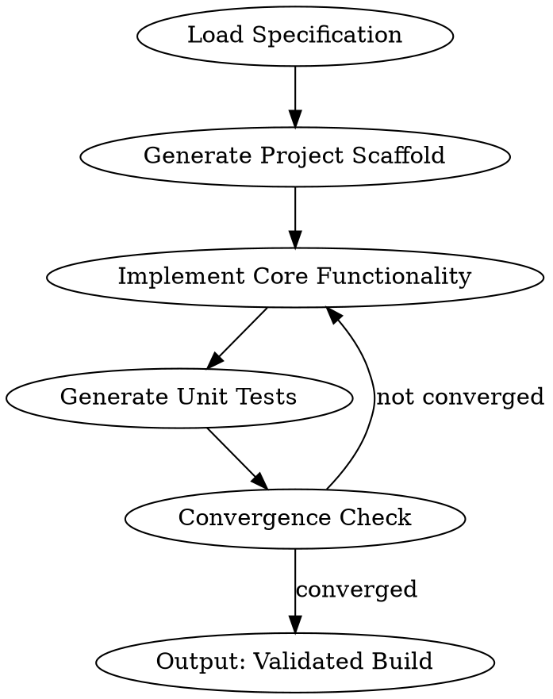

# Attractor Pattern

## Overview

The Attractor is a non-interactive coding agent structured as a **directed graph of phases**, where each node represents a development task and edges are natural-language conditions evaluated by the LLM. It is the orchestration engine for [[software-factory|software factories]], pioneered by [[strongdm]].

Each phase corresponds to a development activity (implement functionality, write tests, identify bottlenecks, refactor) and is governed by a core prompt defining the phase's objective. The agent examines the current codebase state, the phase's completion criteria, and decides which edge to follow next.

## How It Works

The graph is expressed in DOT format (Graphviz):

**Key properties**:
1. **Acyclic at macro level**: Progressing from specification to validated artifact
2. **Controlled cycles for refinement**: Convergence loops allow retrying until criteria are met
3. **LLM-evaluable edges**: Each transition condition is expressed in natural language and evaluated by the agent examining current state
4. **Phase-specific prompts**: Each node has a targeted prompt defining what that phase should accomplish
5. **Provider flexibility**: Different models can run different phases (reasoning-heavy for architecture, fast models for boilerplate)

## The Convergence Process

The Attractor runs until convergence — a state where the software satisfies all specifications and passes [[holdout-scenarios|holdout validation]] at or above the [[software-factory|satisfaction]] threshold.

A production Attractor graph has many more phases and feedback edges than the simplified example above:
- Seed (load spec) → Scaffold (build structure) → Implement (core) → Contract interfaces → Unit tests → Integration tests → Constraint validation → Convergence check
- Convergence check loops back to: Refinement (fix failures) → Implement (functional issues) or Contracts (API violations) or Unit tests (gaps)

## Provider-Aligned Execution

A critical detail from StrongDM's specification: **different LLM providers perform best with their native tool interfaces**. Anthropic models optimize for Claude Code's tool schemas. OpenAI models optimize for Codex schemas. Forcing a universal toolset degrades performance.

For enterprises using multiple providers, the Attractor's graph structure makes multi-provider composition natural: each phase can specify its model and toolset independently.

## Implementations

- **StrongDM's reference implementation**: The original, not yet open-sourced in full
- **Kilroy** (github.com/thewoolleyman/kilroy): A Go-based Attractor implementation. [[software-factory-practitioners-guide-woolley|Woolley's]] primary hands-on tool. Key modification: deterministic pipeline generation via YAML DSL instead of LLM-generated DOT (which produces non-deterministic output)
- **The Attractor NLSpec** (github.com/strongdm/attractor): StrongDM's published specification of what a non-interactive coding agent should do. Can be implemented by anyone; the specification is the contribution, implementation is replaceable.

## Open Questions

1. **Provenance tracking**: The Attractor produces a sequence of phases and transitions. How should the graph traversal be recorded so that later you can trace which specification sections drove which code changes?

2. **Multi-service coordination**: When services have interdependent contracts, should there be a meta-Attractor orchestrating multiple service factories?

3. **Cost optimization**: Different models have different costs. Should the Attractor dynamically choose models based on phase complexity and cost budget?

4. **Convergence criteria**: Beyond satisfaction thresholds, what other criteria determine when the factory should stop iterating?

## Related Concepts

- [[strongdm]] — Creator
- [[shift-work]] — The non-interactive shift where Attractor runs
- [[holdout-scenarios]] — What the Attractor converges against
- [[software-factory]] — The pattern Attractor enables
